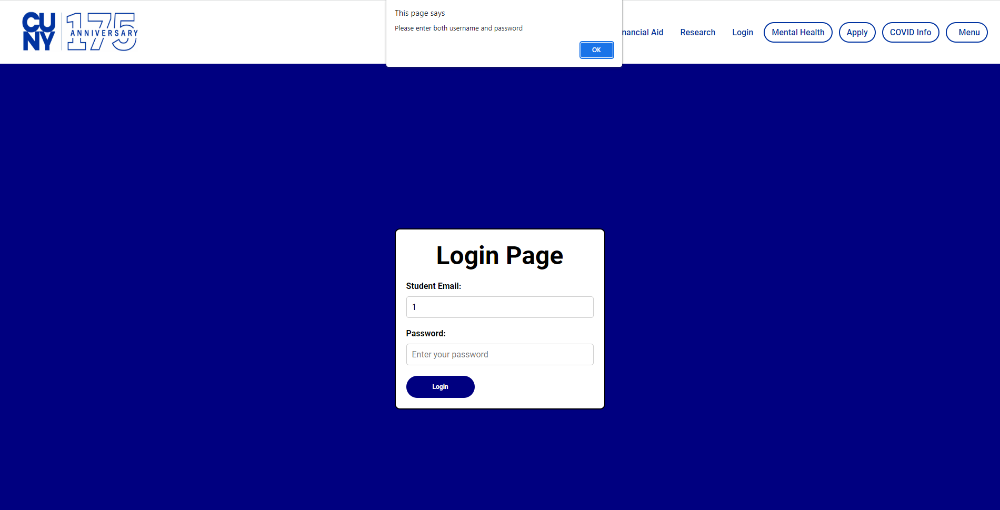
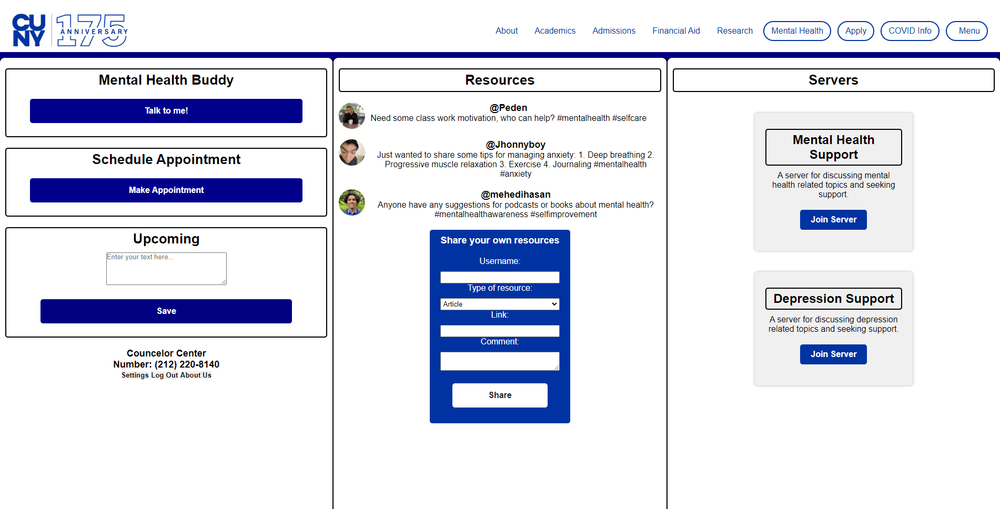
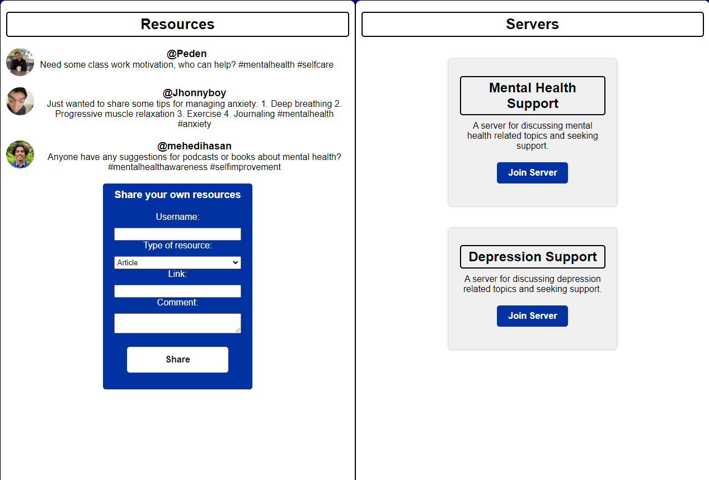

# Mental Health Hub

## About The Project
This is an extension from the CunyFirst website that is dedicated to the mental health of the students and makes it easier to connect with the schools respective counseling center.

## Resources
- Software: Replit, Visual Studio Code
- Language: Python, JavaScript, HTML, CSS

## Login Page
&nbsp;
This login page has a feature if the username or password is not provided a pop-up will appear reminding you to enter what either is missing.

## Counseling Page
&nbsp;
As for this counseling page the idea of a finished website and its features show in the front-end and a third of them are functional

## Non-Functional
&nbsp;
These are 2 columns with an idea of features that aren't functional
### Resources
&nbsp;
There are 3 @'s each a team member from a recent Hackathon. 
&nbsp;
This is an example of a feed focused on uplifting one another by uploading positive suggestions for mental health.
### Servers
* Mental Health Support
  * The idea of this box is it'd redirect you to a chat room with others who're seeking support and can reach a counselor if briefly available
* Depression Support
  * Same idea as 'Mental Health Support' but it's prioritizing Depression Support and more can be added.

## About Us
The team that made this project. 
Jhonny Sanchez - [@LinkedIn](https://www.linkedin.com/in/jhonny-sanchez-589296261/)  
Padan Sherpa - [@LinkedIn](https://www.linkedin.com/in/padan-sherpa-b69b2b143/)  
Mehedi Hasan - [@LinkedIn](https://www.linkedin.com/in/techmehedi/)  
